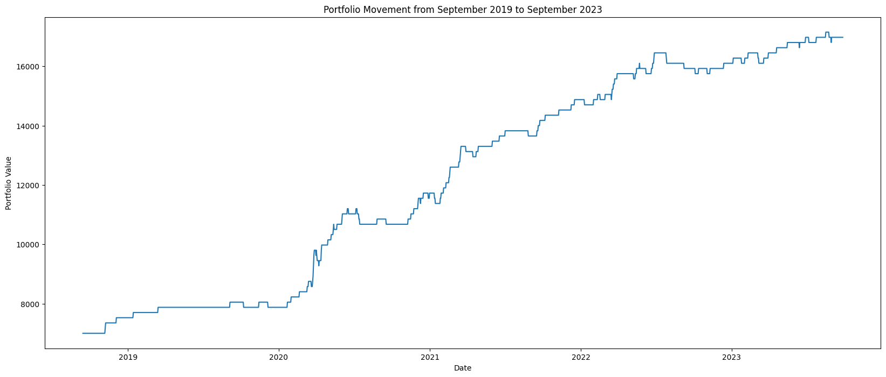

# Momentum-Indicators-Classification-Model
Option-picking model project based on classifying momentum indicators most correlated with short-term gains, finding positive expected value call-options trades

## Overview

This model was developed by testing the various momentum indicators for their correlation with a binary variable representative of whether the underlying asset gained 10% within the next 20 days. These indicators included the Stochastic Oscillator, rate of change in short/long term moving average, divergence of MACD lines, On-Balance Volume (OBV), etc. When running a bi-serial correlation model on these indicators it was identified that stronger correlations exist within the short and long term moving average (SMA, LMA), specifically an extreme rate of change values in the SMA or LMA tend to signify probable gains of 10% for the underlying asset. 

Running a Random Forest Classifier with binary output being whether a 10% gain occurred, and input being the rate of change of the SMA and LMA, the model should be able to classify trading opportunities with a ~70% accuracy. Thus, given an at-the-money call option (calculated to have an average price of 5% of the asset), the expected value of the trade can be calculated as $EV = p(gain) * (.1 - .05) - (1 - p(gain)) * (.05) = .02$, meaning the classification should lead to 2% gain on average for each trade.

Below is a 5 year back test of the model, showing the portfolio value over time with an initial value of $7000.

This project is still in the works, I am looking to implement more accurate analysis based on options-pricing calculated from pricing data as well as additional features to the model such as selling/ executing the option on the last day if optimal or checking if at any point selling the option will lead to better gains than execution. Another option is to check the options chain and find the highest expected value outcome, not necessarily at-the-money, calculated by $EV = p(gain) * (.1 - calculated premium) - (1 - p(gain)) * (calculated premium) = Y$ where $calculated premium$ is the percentage value of the premium relative to the strike that we calculate using a specific strike price, expiry, spot price, and estimated volatility based off of previous price movements. 

